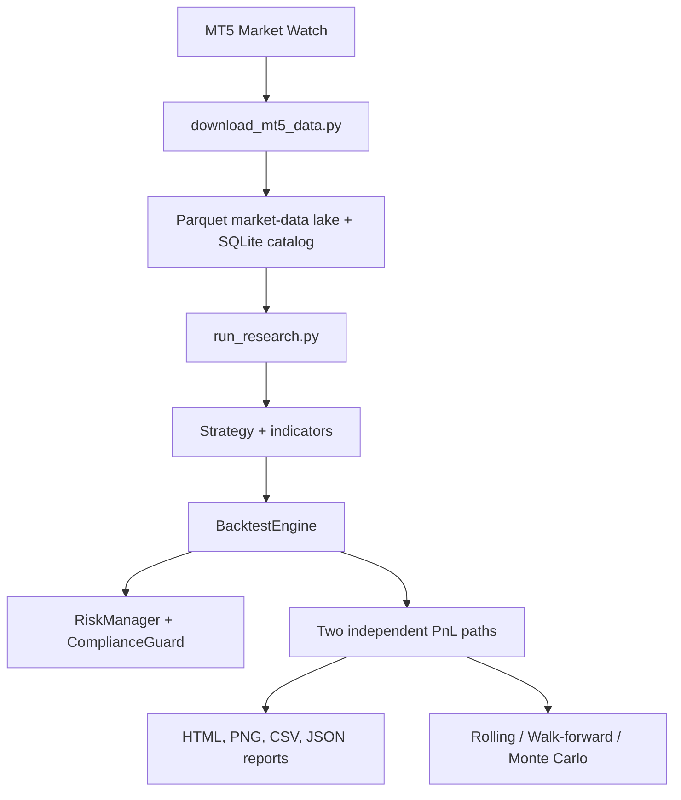

# FTMO Backtest Research Platform — Architecture & Workflow Handoff

**Updated:** 2026-09-23

**Current scope:** offline Python research/backtesting platform fed by MetaTrader 5 data.
**Not in scope yet:** generating or operating an MQL5 Expert Advisor, live execution, or a claim that any current strategy has profitable alpha.

---

## 1. Problem and design objective

This project answers a research question:

> Given historical MT5 OHLC data, a strategy, execution assumptions and FTMO-style loss rules, how does the strategy behave across symbols, timeframes and historical start dates?

The system deliberately separates two questions that are often mixed together:

1. **Strategy quality:** What happens if the signal logic is allowed to trade through the whole history, with realistic position sizing and execution costs but without FTMO loss gates?
2. **Challenge survivability:** What happens to the same strategy when FTMO hard daily-loss and total-loss rules stop new entries?

The first question is the primary research result. The second is a compliance comparison and the basis of the current Monte Carlo simulation.

### Non-negotiable principles

- A strategy creates a signal; it does not know account balance, FTMO rules or broker APIs.
- Risk sizing and compliance are distinct from signal logic.
- One result is reproducible only when its input data snapshot, configuration, source commit and execution assumptions are preserved.
- OHLC backtesting must not pretend to be tick-accurate MT5 testing.
- A backtest is evidence for research, not evidence of future profitability or FTMO compliance.

---

## 2. Current architecture



### Layer responsibilities

| Layer | Main location | Responsibility | Must not do |
|---|---|---|---|
| Data sync | `ftmo_bot/tools/download_mt5_data.py` | Read MT5 history and maintain a resumable local lake | Run strategy logic |
| Storage | `ftmo_bot/tools/market_data_store.py` | Partition bars by symbol/timeframe/month; catalog coverage and fingerprints | Invent or alter prices |
| Indicators | `ftmo_bot/indicators/` | Vectorised causal features derived from OHLC | Place orders or read account state |
| Strategies | `ftmo_bot/strategy/` | Convert available bar information into BUY/SELL signals | Size a position or enforce FTMO rules |
| Backtest engine | `ftmo_bot/backtest/engine.py` | Next-bar execution, one-position state machine, OHLC exits, equity curve | Optimise strategy parameters implicitly |
| Risk and compliance | `ftmo_bot/risk/` | Position sizing, FTMO hard-limit checks and account state | Generate market signals |
| Robustness | `ftmo_bot/backtest/monte_carlo.py`, `walk_forward.py` | Resampling, multiple historical starts and chronological OOS tests | Modify raw source data |
| Reporting | `ftmo_bot/tools/report_builder.py`, `report_charts.py` | Immutable report artifacts and scope labelling | Fill unavailable MT5-only fields with made-up values |

---

## 3. Repository map

```text
mt5_backtest_sys/
├── ftmo_bot/
│   ├── configs/
│   │   ├── mt5_sync.yaml         # MT5 download scope
│   │   ├── research.yaml         # batch-research scope and robustness switches
│   │   ├── instruments.yaml      # exact broker symbols and execution profiles
│   │   ├── ftmo_rules.yaml       # account/challenge hard limits
│   │   └── risk_params.yaml      # position risk and execution assumptions
│   ├── data/market/mt5/          # ignored Parquet lake + SQLite catalog
│   ├── indicators/               # reusable OHLC indicator functions
│   ├── strategy/
│   │   ├── base.py               # BaseStrategy contract
│   │   ├── no1.py … no10.py      # numbered research candidates
│   │   └── candidate_base.py     # shared ATR-based order helper
│   ├── backtest/
│   │   ├── engine.py             # execution and paired-path primitives
│   │   ├── monte_carlo.py
│   │   └── walk_forward.py
│   ├── risk/
│   │   ├── risk_manager.py
│   │   └── compliance_guard.py
│   ├── tools/
│   │   ├── download_mt5_data.py
│   │   ├── run_research.py
│   │   ├── report_builder.py
│   │   └── report_charts.py
│   ├── reports/                  # ignored generated reports and research catalog
│   └── main.py                   # quick single-symbol batch runner
├── tests/
└── ftmo_bot_workflow_handoff.md
```

`data/` and `reports/` are generated local artifacts. Source code and YAML configuration belong in Git; downloaded history and generated reports do not.

---

## 4. Data workflow: MT5 to reproducible Parquet research lake

### 4.1 Synchronisation

`download_mt5_data.py` connects to the locally installed Windows MT5 terminal. It reads all visible Market Watch symbols and configured timeframes, then writes monthly Parquet partitions.

The sync is resumable:

1. Read the latest timestamp for a symbol/timeframe from the SQLite catalog.
2. Request only new MT5 history plus a small overlap.
3. Merge and de-duplicate the affected monthly partition.
4. Record coverage, row count, status and content hash in the catalog.

This avoids repeatedly reading a monolithic CSV and gives every research job a data fingerprint.

### 4.2 Why Parquet instead of CSV

- Columnar reads: load only the OHLC/time columns needed for a job.
- Partition pruning: a bounded time range reads only relevant months.
- Stable schema and efficient storage for many symbols/timeframes.
- SQLite catalog answers “what data is available?” without scanning files.
- A report can retain a fingerprint of the exact partitions used.

Parquet is not an MT5 strategy-tester simulation. It is the historical storage format used by this Python engine.

### 4.3 Admission gates before a job

Before running a strategy/symbol/timeframe job, `run_research.py` checks:

- exact broker symbol is present and enabled in `instruments.yaml`;
- strategy explicitly supports the asset class and timeframe;
- OHLC data has no duplicate timestamps, null OHLC values or impossible high/low values;
- minimum bar count is appropriate for the timeframe.

Gaps are reported as warnings because weekends/market closures are legitimate; structural data corruption fails the job.

---

## 5. Strategy and execution workflow

### 5.1 Strategy contract

Every strategy inherits `BaseStrategy` and implements:

```python
prepare_data(df)    # add only causal indicator columns
generate_signal(row)  # return BUY / SELL signal or None
```

The current numbered candidates are deliberately diverse research hypotheses:

| Files | Family |
|---|---|
| `no1.py`, `no4.py`, `no6.py`, `no10.py` | trend/momentum |
| `no3.py`, `no7.py`, `no9.py` | breakout / volatility expansion |
| `no2.py`, `no5.py`, `no8.py` | mean reversion |

They are not selected production strategies. They should be compared, stress-tested and rejected or refined based on evidence.

### 5.2 Order lifecycle in `BacktestEngine`

1. The strategy observes the completed OHLC bar at time **N** and creates a broker-independent intent.
2. An intent is `MARKET`, `LIMIT`, or `STOP`; all are first eligible at **bar N+1**, never at bar N close.
3. `MARKET` fills at the next open plus adverse spread/slippage.
4. `LIMIT` fills only when its next eligible bar's high/low reaches its trigger. A gap through the limit is filled at the limit, never with unearned price improvement.
5. `STOP` fills when high/low reaches its trigger; a gap beyond the stop fills at the worse bar open.
6. `LIMIT` and `STOP` may specify `valid_for_bars`; otherwise they remain pending until filled or cancelled by the runtime.
7. Position size comes from current equity, risk %, stop distance, contract size and configured costs. The current policy permits one open position and one pending order.
8. On the entry bar and later bars, the engine checks gap exits and OHLC SL/TP hits. If SL and TP are both reachable in one OHLC bar, **SL wins** (`stop_first`).

Every event is retained in the run's `order_events.csv` (`submitted`, `filled`, `expired`, or `rejected_risk`). This is conservative and avoids same-bar look-ahead. It remains an OHLC approximation: it does not reconstruct tick order inside a candle.

---

## 6. Two independent PnL paths

For every job, the runner creates two fresh engine/strategy/risk states. The paths must never share mutable state or equity.

| Path | Loss gates | Purpose |
|---|---|---|
| **No-loss-constraint** | FTMO hard daily/total loss gates disabled | Primary strategy research result across the full history |
| **FTMO-constrained** | Stops opening new positions after a hard daily/total-loss breach | Compliance comparison and Monte Carlo input |

Both paths retain the same strategy logic, next-bar model, spread, slippage, commission model and independent compounding/position sizing. “No loss constraint” does **not** mean free or unrealistic execution; it only removes the two FTMO loss gates.

The constrained path does not use the internal safety buffer as a hard research stop. It stops on actual configured FTMO hard limits.

---

## 7. Robustness workflow

### 7.1 Primary result scope

The following are calculated from the **no-loss-constraint** path:

- performance KPIs and all metric tables;
- trade ledger and trade-distribution/timing charts;
- drawdown, daily returns and monthly-return map;
- rolling-window results;
- walk-forward train/select/test results.

### 7.2 FTMO compliance scope

The following use the **FTMO-constrained** path:

- teal equity line in `01_equity_balance.png`;
- hard-breach marker and compliance status;
- Monte Carlo outcomes.

The orange line in the same chart is the no-loss-constraint path, for comparison.

### 7.3 Robustness methods

| Method | Configuration | Meaning |
|---|---|---|
| Rolling window | `rolling` in `research.yaml` | Start a fresh no-loss account repeatedly through history; measures sensitivity to start date |
| Monte Carlo | `monte_carlo` | Resample constrained trade-day blocks to estimate FTMO outcomes; not a forecast |
| Walk-forward | `walk_forward` | Chronological train → select parameters → out-of-sample test without test-period parameter access |

Use robustness checks progressively: first one symbol/timeframe/strategy, then selected candidates, then a larger batch. Do not enable 10,000 Monte Carlo simulations and broad parameter grids across every market pair in the first run.

---

## 8. Research orchestration

### `main.py`: quick batch runner

Use when one already-loaded symbol/timeframe should be tested against every discovered strategy.

- Reads the Parquet lake first; falls back to legacy CSV only if present.
- Uses the symbol/timeframe in `configs/strategy_params.yaml`.
- Runs all discovered strategies.
- Runs rolling windows and constrained Monte Carlo.
- Does not run walk-forward optimisation.

### `tools/run_research.py`: reproducible research runner

Use for the normal research workflow.

- Selects catalogued symbol/timeframe pairs from `configs/research.yaml`.
- Runs compatibility/data-quality gates.
- Stores a run manifest, job status and data fingerprint.
- Supports rolling, Monte Carlo and walk-forward.
- Creates one immutable report directory per completed strategy/pair job.

`run_research.py` is the source of truth for batch research. `main.py` is a fast convenience runner, not a replacement for catalogued experiments.

---

## 9. Configuration ownership

| File | Owns | Change when |
|---|---|---|
| `configs/mt5_sync.yaml` | MT5 data download universe, timeframe scope, start date | changing imported market data |
| `configs/instruments.yaml` | exact symbol, asset class and execution profile | adding a broker symbol or calibrating contract/spread/slippage |
| `configs/ftmo_rules.yaml` | account size, target and hard FTMO limits | changing challenge/account type |
| `configs/risk_params.yaml` | risk per trade, open-risk cap and execution defaults | changing portfolio/risk assumptions |
| `configs/strategy_params.yaml` or `<strategy>_params.yaml` | strategy parameters | changing an experiment hypothesis |
| `configs/research.yaml` | research filters and robustness switches | choosing which research batch to run |

Never silently change an execution or FTMO parameter inside strategy code. A report’s configuration snapshot is part of its reproducibility record.

---

## 10. Report contract

Each completed job creates a unique timestamped folder under:

```text
ftmo_bot/reports/research/<research_run_id>/<strategy_symbol_timeframe>/<timestamp>/
```

Key artifacts:

| Artifact | Scope |
|---|---|
| `report.html` | Offline visual dossier with embedded PNGs |
| `report.json` | Machine-readable metrics, config, metadata and artifact list |
| `trades.csv` | No-loss-constraint ledger |
| `trades_constrained.csv` | FTMO-constrained ledger |
| `equity_curve.csv` | FTMO-constrained equity/balance curve |
| `equity_curve_unconstrained.csv` | No-loss-constraint equity/balance curve |
| `daily_returns.csv`, `monthly_returns.csv` | No-loss-constraint returns |
| `rolling_windows.csv`, `walk_forward.csv` | No-loss-constraint robustness results |
| `images/01_equity_balance.png` | Both equity paths in one chart |
| `images/07_monte_carlo.png` | FTMO-constrained Monte Carlo only |

`N/A` is intentional for measurements unavailable in an OHLC Python engine, such as MT5 history quality, modeled ticks, margin level, swap, native MT5 deals/orders, MFE/MAE correlations or EA `OnTester` values. The report must not fabricate them.

---

## 11. Development workflow and quality gates

### Add or modify a strategy

1. Create `ftmo_bot/strategy/<name>.py` with one concrete `*Strategy` class.
2. Declare supported asset classes and timeframes explicitly.
3. Keep indicators causal; use `.shift(1)` whenever a current comparison would otherwise use unavailable future data.
4. Add default parameters in the strategy, then optional YAML overrides.
5. Add regression tests for signal validity and any special execution behaviour.
6. Run the complete test suite before committing.

### Add a market

1. Make it visible in MT5 Market Watch.
2. Sync its history into the lake.
3. Add its exact broker symbol to `instruments.yaml` with calibrated contract, point, spread, slippage and commission profile.
4. Only then allow it into batch research.

### Required checks before a commit

```bat
python -m unittest discover -s tests -v
git diff --check
git status
```

The existing suite covers data storage, admission gates, execution integrity, paired paths, reports, candidate discovery and robustness primitives. A green suite does not validate financial profitability.

---

## 12. Operating sequence on Windows

```bat
:: 1. Create/update the local data lake from MT5
python ftmo_bot\tools\download_mt5_data.py

:: 2. Run a reproducible configured research batch
python ftmo_bot\tools\run_research.py

:: Optional: fast run of all strategies for one configured symbol/timeframe
python ftmo_bot\main.py
```

Before the first MT5 sync, install dependencies in the same Python environment that will run the script and make sure the MT5 terminal is installed, logged in and has the required symbols visible in Market Watch.

For an initial safe experiment, limit `research.yaml` to one strategy, symbol and timeframe, set `max_jobs: 1`, use rolling windows, and keep Monte Carlo/walk-forward off until the basic result is understood.

---

## 13. Known limitations and next decisions

1. The engine is bar-close OHLC, not tick replay; results can differ from MT5 Strategy Tester.
2. Execution values are configured assumptions and must be calibrated per broker/account.
3. Current instrument registry is limited to profiled metal symbols; data may exist for more symbols but unprofiled symbols are intentionally skipped.
4. Numbered strategies are research baselines, not validated alpha.
5. The shared order-intent contract is now ready for paper/live adapters, but there is no MT5 execution adapter or reconciliation loop yet.
6. FTMO terms and account rules are configuration inputs, not permanent facts; verify them before an actual challenge.

### Recommended next milestone

Run a narrow research batch for each candidate on XAUUSD/XAUUSDm M5 and M15, compare market versus explicit limit/stop entry hypotheses, then enable constrained Monte Carlo and a small walk-forward grid only for candidates that remain credible out-of-sample. After that, build an MT5 demo adapter against the same order-intent contract.
